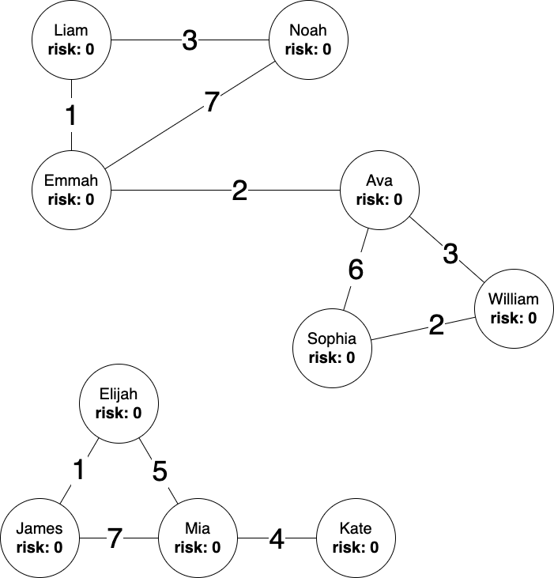
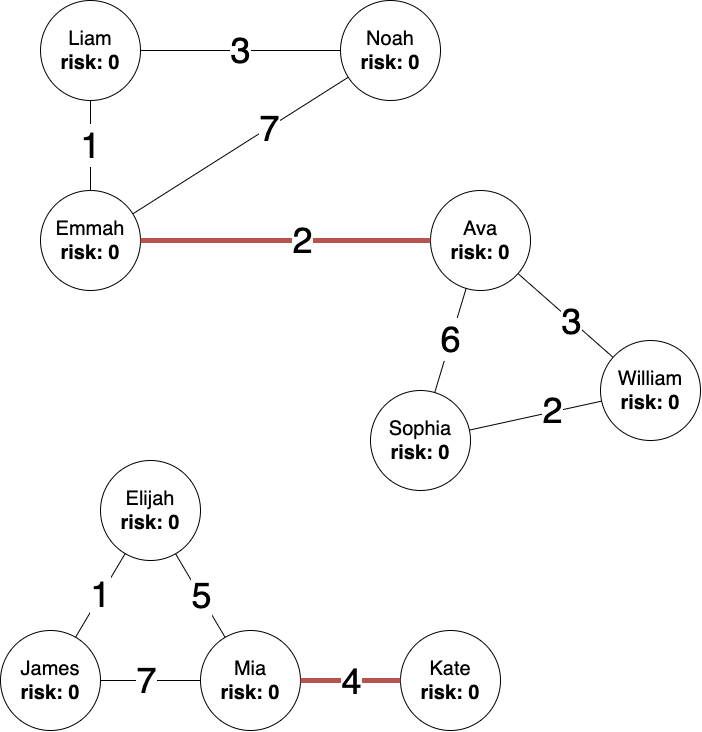
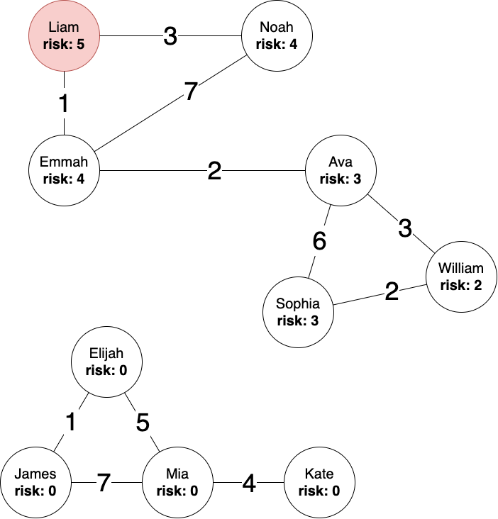

<h3>The Problem:</h3>
<body>
When a member of a social group contracts COVID-19 there is no universal procedure for alerting friends, and friends of friends. The responsibility falls on lots of different people all actively and responsibly spreading accurate information. This is not always a realistic expectation. Also, there isn't a way to quantify the risk level for each person within that social group - for example if John hangs out with Lucy 5 times per week and John tests positive for COVID-19, Lucy is at a much higher risk level than Lucy's friend whom Lucy visits once per week. Finally, sometimes there is a social connection between two people which link two otherwise separate social circles. These connections are dangerous because a positive COVID-19 test in one circle can use that connection like a bridge to infect the other. Two people engaged in such a connection may not have any idea how dangerous that "bridge" connection is.
</body>

<h3>Program Description:</h3>
<body>
This project simulates a working solution to the problems above. It uses a file (in our demo it's friends.txt) as input to create an undirected graph representing a social network. The file is in the format 
 <code> 
 name,email  name2,email2  #_of_times_they_hang_out_per_week 
 </code> 
 The social network built from friends.txt looks like this:
  
Each node represents a person in the network, and each edge represents a social connection. The weight of the connection is the frequency they see each other per week. Recall above our definition of a bridge connection above. The program detects these bridge connections using Tarjan's SCC Algorithm.
  
 There is an option to 'email' (ouput) the two parties involved in the bridge connection 
<code>
(Sent to ava@email.com) Dear Ava, our data indicates that your relationship 
with Emmah could potentially be dangerous for public health because 
it bridges two social circles who otherwise would not be in contact. Please 
wear a mask and socially distance if you are around them. They have recieved this same message.
</code>
The same message is addressed and sent to Emmah.
Now we will simulate what happens when somebody tests positive. For our demo we'll use Liam (sorry Liam). Everyone in his social circle will require an update to their risk-level. Risk-level will propogate appropriately to friends of friends, decreasing as distance from Liam increases and visitation frequency between friends decreases. Regardless of frequency, anyone directly connected to Liam will be given the highest risk level. From there, the program uses a modified version of Dijkstra's Shortest Paths Algorithm to properly assign risk levels. Risk levels range from 5 (infected) to 0 (low risk). Here's our network after Liam tested positive for COVID-19:
  
Like before, we have the option to 'email' everyone who was affected
<code>
(Sent to liam@email.com) Attention Liam: You have tested positive for COVID-19. Please immediately enter into self-quarantine for 14 days

(Sent to noah@email.com) Attention Noah: Liam has tested positive for COVID-19. Our records indicate you are in the same social circle. Your risk factor for contracting COVID-19 is listed as 4, on a scale from 0 (low risk) to 5(infected).

...Emmah, Ava, and William are emailed similarly...

(Sent to sophia@email.com) Attention Sophia: Liam has tested positive for COVID-19. Our records indicate you are in the same social circle. Your risk factor for contracting COVID-19 is listed as 3, on a scale from 0 (low risk) to 5(infected).
</code>
 
</body>

<h3>Next Steps:</h3>
<body>
I'd like to morph this into a Flask application. The frontend would be a form where people could enter the names, emails, and visitation frequencies of people they see every week without social distancing. This information could be stored in a database and would be used to create and modify the network. I would also like to add support for people testing negative, but I think it could spread a false sense of safety, expecially if others in the network are still positive.
</body>

<h3>Potential implementations:</h3>
<ol>
  <li><b>Greek life on college campuses.</b></li>
  <li><b>Large offices / manufacturing centers.</b></li>
</ol>
